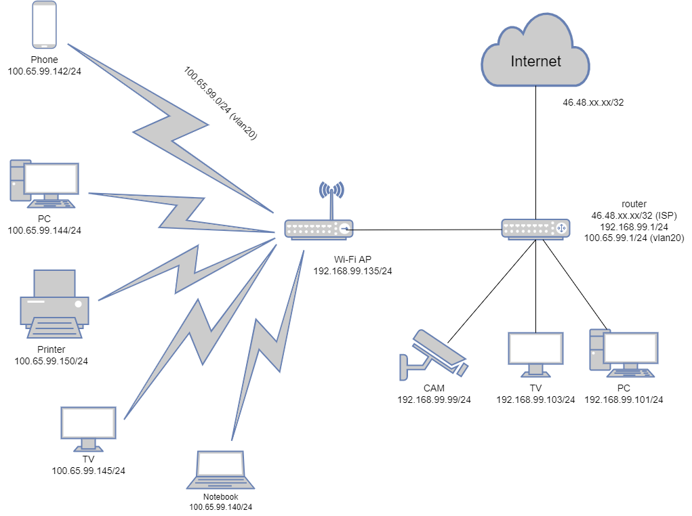

## Домашнее задание к занятию "3.8. Компьютерные сети, лекция 3"
### 1. Подключитесь к публичному маршрутизатору в интернет. Найдите маршрут к вашему публичному IP
    telnet route-views.routeviews.org
    Username: rviews
    show ip route x.x.x.x/32
    show bgp x.x.x.x/32
##
    route-views>show ip route 212.49.xx.xx
    Routing entry for 212.49.96.0/19, supernet
    Known via "bgp 6447", distance 20, metric 0
    Tag 3303, type external
    Last update from 217.192.89.50 2w6d ago
    Routing Descriptor Blocks:
    * 217.192.89.50, from 217.192.89.50, 2w6d ago
      Route metric is 0, traffic share count is 1
      AS Hops 3
      Route tag 3303
      MPLS label: none
####
    route-views>show bgp 212.49.xx.xx
    BGP routing table entry for 212.49.96.0/19, version 2533370301
    Paths: (22 available, best #21, table default)
        Not advertised to any peer
        Refresh Epoch 1
        3267 12389 12668
          194.85.40.15 from 194.85.40.15 (185.141.126.1)
            Origin IGP, metric 0, localpref 100, valid, external
            path 7FE156E74298 RPKI State not found
            rx pathid: 0, tx pathid: 0
        Refresh Epoch 1
        701 5511 12389 12668
          137.39.3.55 from 137.39.3.55 (137.39.3.55)
            Origin IGP, localpref 100, valid, external
            path 7FE04059B3F8 RPKI State not found
            rx pathid: 0, tx pathid: 0
        Refresh Epoch 1
        8283 1299 12389 12668
          94.142.247.3 from 94.142.247.3 (94.142.247.3)
            Origin IGP, metric 0, localpref 100, valid, external
            Community: 1299:30000 8283:1 8283:101
            unknown transitive attribute: flag 0xE0 type 0x20 length 0x18
            value 0000 205B 0000 0000 0000 0001 0000 205B
              0000 0005 0000 0001
            path 7FDFFD2C79B0 RPKI State not found
            rx pathid: 0, tx pathid: 0
    ......
        Refresh Epoch 1
        1351 6939 12389 12668
          132.198.255.253 from 132.198.255.253 (132.198.255.253)
            Origin IGP, localpref 100, valid, external
            path 7FE1524D0DE8 RPKI State not found
            rx pathid: 0, tx pathid: 0
        Refresh Epoch 1
        3303 12389 12668
          217.192.89.50 from 217.192.89.50 (138.187.128.158)
            Origin IGP, localpref 100, valid, external, best
            Community: 3303:1004 3303:1006 3303:1030 3303:3056 12668:0
            path 7FE175BEDB10 RPKI State not found
            rx pathid: 0, tx pathid: 0x0
        Refresh Epoch 1
        3257 3356 12389 12668
          89.149.178.10 from 89.149.178.10 (213.200.83.26)
            Origin IGP, metric 10, localpref 100, valid, external
            Community: 3257:8794 3257:30043 3257:50001 3257:54900 3257:54901
            path 7FE0A16CB7B0 RPKI State not found
            rx pathid: 0, tx pathid: 0

### 2. Создайте dummy0 интерфейс в Ubuntu. Добавьте несколько статических маршрутов. Проверьте таблицу маршрутизации.
    vagrant@vagrant:~$ sudo ip link add dummy0 type dummy
    vagrant@vagrant:~$ sudo ip addr add 10.10.5.1/24 dev dummy0
    vagrant@vagrant:~$ sudo ip link set dummy0 up
    vagrant@vagrant:~$ sudo ip route add to 10.10.10.0/24 via 10.10.5.1
    vagrant@vagrant:~$ sudo ip route add to 10.10.20.0/24 via 10.10.5.1
    vagrant@vagrant:~$ ip r
    default via 10.0.2.2 dev eth0 proto dhcp src 10.0.2.15 metric 100
    10.0.2.0/24 dev eth0 proto kernel scope link src 10.0.2.15
    10.0.2.2 dev eth0 proto dhcp scope link src 10.0.2.15 metric 100
    10.10.5.0/24 dev dummy0 proto kernel scope link src 10.10.5.1
    10.10.10.0/24 via 10.10.5.1 dev dummy0
    10.10.20.0/24 via 10.10.5.1 dev dummy0

### 3. Проверьте открытые TCP порты в Ubuntu, какие протоколы и приложения используют эти порты? Приведите несколько примеров.
    vagrant@vagrant:~$ ss -tulpn
    Netid    State     Recv-Q    Send-Q        Local Address:Port       Peer Address:Port   Process
    tcp      LISTEN    0         4096          127.0.0.53%lo:53              0.0.0.0:*
    tcp      LISTEN    0         128                 0.0.0.0:22              0.0.0.0:*
    tcp      LISTEN    0         128                    [::]:22                 [::]:*
#### На VM открыты порты 53 (DNS), 22 (SSH)
    
### 4. Проверьте используемые UDP сокеты в Ubuntu, какие протоколы и приложения используют эти порты?
    vagrant@vagrant:~$ ss -ulnp
    State      Recv-Q     Send-Q          Local Address:Port         Peer Address:Port     Process
    UNCONN     0          0               127.0.0.53%lo:53                0.0.0.0:*
    UNCONN     0          0              10.0.2.15%eth0:68                0.0.0.0:*
#### Порты 53 (DNS) и 68 (Используется для получения клиентом сетевых настроек от dhcp)

### 5. Используя diagrams.net, создайте L3 диаграмму вашей домашней сети или любой другой сети, с которой вы работали.
