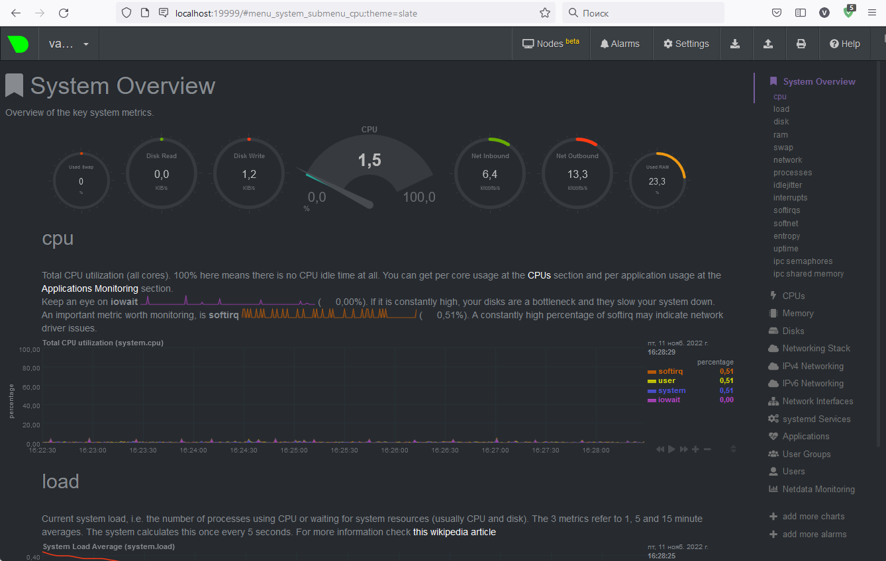

### 1. На лекции мы познакомились с node_exporter. В демонстрации его исполняемый файл запускался в background. Этого достаточно для демо, но не для настоящей production-системы, где процессы должны находиться под внешним управлением. Используя знания из лекции по systemd, создайте самостоятельно простой unit-файл для node_exporter:
+ поместите его в автозагрузку

    cd /tmp
    wget https://github.com/prometheus/node_exporter/releases/download/v1.3.1/node_exporter-1.3.1.linux-amd64.tar.gz
    tar zxvf node_exporter-1.3.1.linux-amd64.tar.gz
    cd node_exporter-*.linux-amd64
    sudo cp node_exporter /usr/local/bin/
    sudo touch /opt/node_exporter.env
    sudo useradd --no-create-home --shell /bin/false nodeuser
    sudo chown -R nodeuser:nodeuser /usr/local/bin/node_exporter
    sudo chown -R nodeuser:nodeuser /opt/node_exporter.env

    sudo nano /etc/systemd/system/node_exporter.service
    ******
    [Unit]
    Description=Node Exporter Service
    After=network.target

    [Service]
    User=nodeuser
    Group=nodeuser
    Type=simple
    ExecStart=/usr/local/bin/node_exporter
    ExecReload=/bin/kill -HUP $MAINPID
    EnvironmentFile=/opt/node_exporter.env
    Restart=on-failure

    [Install]
    WantedBy=multi-user.target
    ******

    systemctl daemon-reload
    systemctl enable node_exporter.service
    systemctl start node_exporter.service

+ предусмотрите возможность добавления опций к запускаемому процессу через внешний файл (посмотрите, например, на systemctl cat cron),

    
    echo "OPTS_LOG_LEVEL=\"--log.level=info\"" | sudo tee /opt/node_exporter.env

+ удостоверьтесь, что с помощью systemctl процесс корректно стартует, завершается, а после перезагрузки автоматически поднимается.

    
    vagrant@vagrant:/tmp/node_exporter-1.3.1.linux-amd64$ systemctl stop node_exporter
    ==== AUTHENTICATING FOR org.freedesktop.systemd1.manage-units ===
    Authentication is required to stop 'node_exporter.service'.
    Authenticating as: vagrant
    Password:
    ==== AUTHENTICATION COMPLETE ===
    vagrant@vagrant:/tmp/node_exporter-1.3.1.linux-amd64$ systemctl start node_exporter
    ==== AUTHENTICATING FOR org.freedesktop.systemd1.manage-units ===
    Authentication is required to start 'node_exporter.service'.
    Authenticating as: vagrant
    Password:
    ==== AUTHENTICATION COMPLETE ===
    vagrant@vagrant:/tmp/node_exporter-1.3.1.linux-amd64$ journalctl -u node_exporter
    Nov 11 09:47:09 vagrant systemd[1]: Stopping Node Exporter Service...
    Nov 11 09:47:09 vagrant systemd[1]: node_exporter.service: Succeeded.
    Nov 11 09:47:09 vagrant systemd[1]: Stopped Node Exporter Service.
    Nov 11 09:47:21 vagrant systemd[1]: Started Node Exporter Service.
    Nov 11 09:47:21 vagrant node_exporter[4944]: ts=2022-11-11T09:47:21.796Z caller=node_exporter.go:182 level=info msg="Starting node_exporter" version="(version=1.3.1, branch=HEAD, revision=a2321e7b940ddcff2687>
    Nov 11 09:47:21 vagrant node_exporter[4944]: ts=2022-11-11T09:47:21.804Z caller=node_exporter.go:183 level=info msg="Build context" build_context="(go=go1.17.3, user=root@243aafa5525c, date=20211205-11:09:49)"
    Nov 11 09:47:21 vagrant node_exporter[4944]: ts=2022-11-11T09:47:21.806Z caller=filesystem_common.go:111 level=info collector=filesystem msg="Parsed flag --collector.filesystem.mount-points-exclude" flag=^/(d>
    Nov 11 09:47:21 vagrant node_exporter[4944]: ts=2022-11-11T09:47:21.806Z caller=filesystem_common.go:113 level=info collector=filesystem msg="Parsed flag --collector.filesystem.fs-types-exclude" flag=^(autofs>
    Nov 11 09:47:21 vagrant node_exporter[4944]: ts=2022-11-11T09:47:21.808Z caller=node_exporter.go:108 level=info msg="Enabled collectors"
    Nov 11 09:47:21 vagrant node_exporter[4944]: ts=2022-11-11T09:47:21.808Z caller=node_exporter.go:115 level=info collector=arp
    Nov 11 09:47:21 vagrant node_exporter[4944]: ts=2022-11-11T09:47:21.808Z caller=node_exporter.go:115 level=info collector=bcache

### 2. Ознакомьтесь с опциями node_exporter и выводом /metrics по-умолчанию. Приведите несколько опций, которые вы бы выбрали для базового мониторинга хоста по CPU, памяти, диску и сети.
#### Для CPU
    node_cpu_seconds_total{cpu="0",mode="idle"} 2.80641314e+06
    node_cpu_seconds_total{cpu="0",mode="iowait"} 2087.7
    node_cpu_seconds_total{cpu="0",mode="irq"} 0
    node_cpu_seconds_total{cpu="0",mode="nice"} 0.34
    node_cpu_seconds_total{cpu="0",mode="softirq"} 10.72
    node_cpu_seconds_total{cpu="0",mode="steal"} 0
    node_cpu_seconds_total{cpu="0",mode="system"} 7287.16
    node_cpu_seconds_total{cpu="0",mode="user"} 3904.6
    node_cpu_seconds_total{cpu="1",mode="idle"} 2.80123841e+06
    node_cpu_seconds_total{cpu="1",mode="iowait"} 3336.15
    node_cpu_seconds_total{cpu="1",mode="irq"} 0
    node_cpu_seconds_total{cpu="1",mode="nice"} 0.43
    node_cpu_seconds_total{cpu="1",mode="softirq"} 17.69
    node_cpu_seconds_total{cpu="1",mode="steal"} 0
    node_cpu_seconds_total{cpu="1",mode="system"} 5614.75
    node_cpu_seconds_total{cpu="1",mode="user"} 9494.01
#### Для памяти
    node_memory_MemAvailable_bytes 3.414028288e+09
    node_memory_MemFree_bytes 3.400814592e+09
    node_memory_MemTotal_bytes 3.975114752e+09
    node_memory_SwapCached_bytes 0
    node_memory_SwapFree_bytes 4.177522688e+09
#### Для диска
    node_filesystem_avail_bytes{device="/dev/mapper/ubuntu--vg-ubuntu--lv",fstype="lvm",mountpoint="/"} 9.8496856064e+10
    node_filesystem_readonly{device="/dev/mapper/ubuntu--vg-ubuntu--lv",fstype="lvm",mountpoint="/"} 0
    node_filesystem_size_bytes{device="/dev/mapper/ubuntu--vg-ubuntu--lv",fstype="lvm",mountpoint="/"} 1.02616997888e+11
    node_disk_io_now{device="sda"} 0
#### Для сети
    node_network_info{address="08:00:27:a2:6b:fd",broadcast="ff:ff:ff:ff:ff:ff",device="eth0",duplex="full",ifalias="",operstate="up"} 1
    node_network_receive_bytes_total{device="eth0"} 1.751733584e+09
    node_network_receive_errs_total{device="eth0"} 0
    node_network_transmit_bytes_total{device="eth0"} 8.161797426e+09
    node_network_transmit_errs_total{device="eth0"} 0

### 3. Установите в свою виртуальную машину Netdata. Воспользуйтесь готовыми пакетами для установки (sudo apt install -y netdata).
+ в конфигурационном файле /etc/netdata/netdata.conf в секции [web] замените значение с localhost на bind to = 0.0.0.0,
  

    sudo nano /etc/netdata/netdata.conf
    [global]
    run as user = netdata
    web files owner = root
    web files group = root
    ## Netdata is not designed to be exposed to potentially hostile
    ## networks. See https://github.com/netdata/netdata/issues/164
    ## bind socket to IP = 127.0.0.1
    bind to = 0.0.0.0

+ добавьте в Vagrantfile проброс порта Netdata на свой локальный компьютер и сделайте vagrant reload:

    config.vm.network "forwarded_port", guest: 19999, host: 19999

### 4. Можно ли по выводу dmesg понять, осознает ли ОС, что загружена не на настоящем оборудовании, а на системе виртуализации?
    vagrant@vagrant:~$ dmesg | grep -i virtualized
    [    0.006137] CPU MTRRs all blank - virtualized system.
    [    0.042555] Booting paravirtualized kernel on KVM

### 5. Как настроен sysctl fs.nr_open на системе по-умолчанию? Узнайте, что означает этот параметр. Какой другой существующий лимит не позволит достичь такого числа (ulimit --help)?
    vagrant@vagrant:~$ sysctl -n fs.nr_open
    1048576
#### Это максимальное число открытых дескрипторов для ядра (системы)
    vagrant@vagrant:~$ ulimit -Sn
    1024
#### Soft limit на пользователя, может быть увеличен в большую или меньшую сторону.
    vagrant@vagrant:~$ ulimit -Hn
    1048576
#### Hard limit на прользователя, не может быть увеличин, только уменьшен.
#### Оба ulimit -n не могут превышать fs.nr_open
    vagrant@vagrant:~$ cat /proc/sys/fs/file-max
    9223372036854775807
#### Максимальное значение дискрипторов открытых файлов для хоста.

### 6. Запустите любой долгоживущий процесс (не ls, который отработает мгновенно, а, например, sleep 1h) в отдельном неймспейсе процессов; покажите, что ваш процесс работает под PID 1 через nsenter. Для простоты работайте в данном задании под root (sudo -i). Под обычным пользователем требуются дополнительные опции (--map-root-user) и т.д.
#### В консоли 1
    vagrant@vagrant:~$ sudo unshare -f --pid --mount-proc sleep 1h
#### В консоли 2
    vagrant@vagrant:~$ sudo nsenter --target 1602 --pid --mount ps aux
    USER         PID %CPU %MEM    VSZ   RSS TTY      STAT START   TIME COMMAND
    root           1  0.0  0.0   5476   580 pts/0    S+   11:49   0:00 sleep 1h
    root          16  0.0  0.3   8888  3296 pts/1    R+   11:51   0:00 ps aux

### 7. Найдите информацию о том, что такое :(){ :|:& };:. Запустите эту команду в своей виртуальной машине Vagrant с Ubuntu 20.04 (это важно, поведение в других ОС не проверялось). Некоторое время все будет "плохо", после чего (минуты) – ОС должна стабилизироваться. Вызов dmesg расскажет, какой механизм помог автоматической стабилизации. Как настроен этот механизм по-умолчанию, и как изменить число процессов, которое можно создать в сессии?
#### Эта команда является логической бомбой. Она оперирует определением функции с именем ‘:‘, которая вызывает сама себя дважды: один раз на переднем плане и один раз в фоне. Она продолжает своё выполнение снова и снова, пока система не зависнет.
#### тут система стабилизировлась
    [ 2620.239165] cgroup: fork rejected by pids controller in /user.slice/user-1000.slice/session-1.scope
#### В /usr/lib/systemd/system/user-.slice.d/10-defaults.conf регулируется число процессов, которое доступно для создания в сессии.

