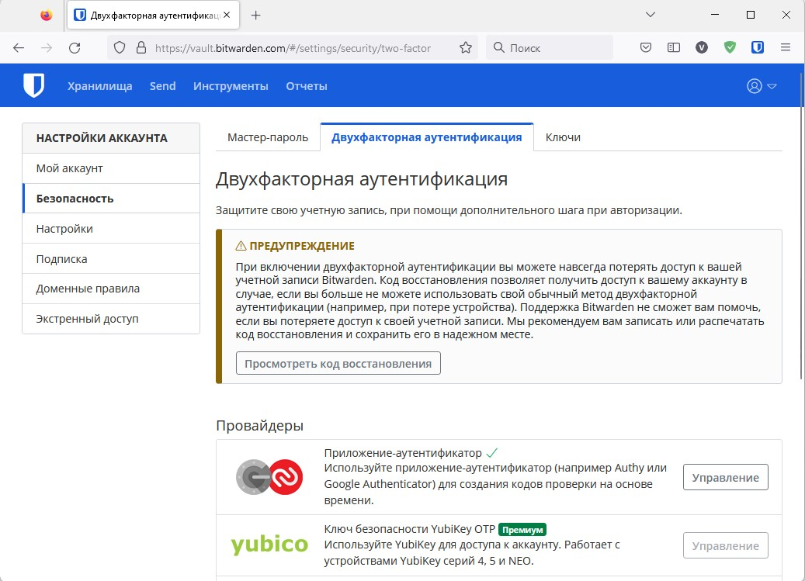

## Домашнее задание к занятию "3.9. Элементы безопасности информационных систем"
### 1. Установите Bitwarden плагин для браузера. Зарегестрируйтесь и сохраните несколько паролей.

### 2. Установите Google authenticator на мобильный телефон. Настройте вход в Bitwarden акаунт через Google authenticator OTP.

### 3. Установите apache2, сгенерируйте самоподписанный сертификат, настройте тестовый сайт для работы по HTTPS.
    $ sudo apt install paache2
    $ cd /etc/apache2
    $ $ sudo mkdir ssl ; cd ssl
    $ sudo openssl req -x509 -days 30 -nodes -newkey rsa:2048 -out cert.pem -keyout cert.key
    $ sudo a2enmod ssl
    $ systemctl restart apache2
    
    $ sudo nano /etc/apache2/sites-enabled/000-default.conf
    <VirtualHost *:80>
        Redirect "/" "https://localhost/"
    ServerAdmin webmaster@localhost
        DocumentRoot /var/www/html
    ErrorLog ${APACHE_LOG_DIR}/error.log
        CustomLog ${APACHE_LOG_DIR}/access.log combined
    </VirtualHost>
    <VirtualHost *:443>
        ServerName localhost
        DocumentRoot /var/www/html
        SSLEngine on
        SSLCertificateFile ssl/cert.pem
        SSLCertificateKeyFile ssl/cert.key
    </VirtualHost>
    
    $ sudo systemctl restart apache2
####

### 4. Проверьте на TLS уязвимости произвольный сайт в интернете (кроме сайтов МВД, ФСБ, МинОбр, НацБанк, РосКосмос, РосАтом, РосНАНО и любых госкомпаний, объектов КИИ, ВПК ... и тому подобное).
    vagrant@vagrant:~/testssl.sh$ ./testssl.sh -U --sneaky https://habr.com

    ###########################################################
    testssl.sh       3.2rc2 from https://testssl.sh/dev/
    (198bb09 2022-11-28 17:09:04)

      This program is free software. Distribution and
             modification under GPLv2 permitted.
      USAGE w/o ANY WARRANTY. USE IT AT YOUR OWN RISK!

       Please file bugs @ https://testssl.sh/bugs/

    ###########################################################

    Using "OpenSSL 1.0.2-bad (1.0.2k-dev)" [~183 ciphers]
    on vagrant:./bin/openssl.Linux.x86_64
    (built: "Sep  1 14:03:44 2022", platform: "linux-x86_64")

    Start 2022-12-02 05:04:18        -->> 178.248.237.68:443 (habr.com) <<--

    rDNS (178.248.237.68):  --
    Service detected:       HTTP

    Testing vulnerabilities

    Heartbleed (CVE-2014-0160)                not vulnerable (OK), no heartbeat extension
    CCS (CVE-2014-0224)                       not vulnerable (OK)
    Ticketbleed (CVE-2016-9244), experiment.  not vulnerable (OK)
    ROBOT                                     not vulnerable (OK)
    Secure Renegotiation (RFC 5746)           supported (OK)
    Secure Client-Initiated Renegotiation     not vulnerable (OK)
    CRIME, TLS (CVE-2012-4929)                not vulnerable (OK)
    BREACH (CVE-2013-3587)                    no gzip/deflate/compress/br HTTP compression (OK)  - only supplied "/" tested
    POODLE, SSL (CVE-2014-3566)               not vulnerable (OK)
    TLS_FALLBACK_SCSV (RFC 7507)              No fallback possible (OK), no protocol below TLS 1.2 offered
    SWEET32 (CVE-2016-2183, CVE-2016-6329)    VULNERABLE, uses 64 bit block ciphers
    FREAK (CVE-2015-0204)                     not vulnerable (OK)
    DROWN (CVE-2016-0800, CVE-2016-0703)      not vulnerable on this host and port (OK)
                                           make sure you don't use this certificate elsewhere with SSLv2 enabled services, see
                                           https://search.censys.io/search?resource=hosts&virtual_hosts=INCLUDE&q=911F5FFC18D826413DCC656A3B1CF9E38229099A3F410F98F64C2AD9915B3336
    LOGJAM (CVE-2015-4000), experimental      not vulnerable (OK): no DH EXPORT ciphers, no DH key detected with <= TLS 1.2
    BEAST (CVE-2011-3389)                     not vulnerable (OK), no SSL3 or TLS1
    LUCKY13 (CVE-2013-0169), experimental     potentially VULNERABLE, uses cipher block chaining (CBC) ciphers with TLS. Check patches
    Winshock (CVE-2014-6321), experimental    not vulnerable (OK)
    RC4 (CVE-2013-2566, CVE-2015-2808)        no RC4 ciphers detected (OK)

    Done 2022-12-02 05:04:47 [  32s] -->> 178.248.237.68:443 (habr.com) <<--
### 5. Установите на Ubuntu ssh сервер, сгенерируйте новый приватный ключ. Скопируйте свой публичный ключ на другой сервер. Подключитесь к серверу по SSH-ключу.
+ Создал через vagrant две VM (host1 и host2) со строкой в конфиге config.vm.network "public_network"
+ На host2 сгенерировал ключ и передал на host1
 #####
    vagrant@host2:~$ ssh-keygen
    Generating public/private rsa key pair.
    Enter file in which to save the key (/home/vagrant/.ssh/id_rsa):
    Enter passphrase (empty for no passphrase):
    Enter same passphrase again:
    Your identification has been saved in /home/vagrant/.ssh/id_rsa
    Your public key has been saved in /home/vagrant/.ssh/id_rsa.pub
    The key fingerprint is:
    SHA256:iW1AL/otjJGpoRjNBcqwCm3vxIwAygbdN83Vurs8FrY vagrant@host2
    The key's randomart image is:
    +---[RSA 3072]----+
    |+...  .o ...     |
    |B+....o.o   .    |
    |*+o ..o..  .     |
    |+= * + = ..      |
    |o = X . S  .     |
    |.o = = o  +      |
    |o . o + .. +     |
    |       . .E      |
    |         .oo     |
    +----[SHA256]-----+
#####
    vagrant@host2:~$ ssh-copy-id -i .ssh/id_rsa.pub vagrant@192.168.151.128
    /usr/bin/ssh-copy-id: INFO: Source of key(s) to be installed: ".ssh/id_rsa.pub"
    The authenticity of host '192.168.151.128 (192.168.151.128)' can't be established.
    ECDSA key fingerprint is SHA256:8Lb/tKqeyNQllMhaDRbn8d8aX/ef6T2IkQ5EWnKa01s.
    Are you sure you want to continue connecting (yes/no/[fingerprint])? yes
    /usr/bin/ssh-copy-id: INFO: attempting to log in with the new key(s), to filter out any that are already installed
    /usr/bin/ssh-copy-id: INFO: 1 key(s) remain to be installed -- if you are prompted now it is to install the new keys
    vagrant@192.168.151.128's password:

    Number of key(s) added: 1

    Now try logging into the machine, with:   "ssh 'vagrant@192.168.151.128'"
    and check to make sure that only the key(s) you wanted were added.
#####
    vagrant@host2:~$ ssh vagrant@192.168.151.128
    Welcome to Ubuntu 20.04.5 LTS (GNU/Linux 5.4.0-135-generic x86_64)

    * Documentation:  https://help.ubuntu.com
    * Management:     https://landscape.canonical.com
    * Support:        https://ubuntu.com/advantage

    System information as of Fri 02 Dec 2022 06:16:39 AM UTC

    System load:  0.0                Processes:             120
    Usage of /:   13.4% of 30.58GB   Users logged in:       1
    Memory usage: 21%                IPv4 address for eth0: 10.0.2.15
    Swap usage:   0%                 IPv4 address for eth1: 192.168.151.128

    This system is built by the Bento project by Chef Software
    More information can be found at https://github.com/chef/bento
    Last login: Fri Dec  2 06:05:19 2022 from 10.0.2.2
    vagrant@host1:~$
#####
### 6. Переименуйте файлы ключей из задания 5. Настройте файл конфигурации SSH клиента, так чтобы вход на удаленный сервер осуществлялся по имени сервера.
    vagrant@host2:~$ sudo mv .ssh/id_rsa.pub .ssh/host1.pub
    vagrant@host2:~$ sudo nano .ssh/config
    vagrant@host2:~$ cat .ssh/config
    Host Host1
        HostName 192.168.151.128
        User vagrant
        Port 22
        IdentityFile ~/.ssh/host1
    vagrant@host2:~$ ssh Host1
    Welcome to Ubuntu 20.04.5 LTS (GNU/Linux 5.4.0-135-generic x86_64)

    * Documentation:  https://help.ubuntu.com
    * Management:     https://landscape.canonical.com
    * Support:        https://ubuntu.com/advantage

    System information as of Fri 02 Dec 2022 06:34:24 AM UTC

    System load:  0.0                Processes:             119
    Usage of /:   13.4% of 30.58GB   Users logged in:       1
    Memory usage: 21%                IPv4 address for eth0: 10.0.2.15
    Swap usage:   0%                 IPv4 address for eth1: 192.168.151.128

    This system is built by the Bento project by Chef Software
    More information can be found at https://github.com/chef/bento
    Last login: Fri Dec  2 06:29:30 2022 from 192.168.151.222

    vagrant@host1:~$
### 7. Соберите дамп трафика утилитой tcpdump в формате pcap, 100 пакетов. Откройте файл pcap в Wireshark.

### 8. Просканируйте хост scanme.nmap.org. Какие сервисы запущены?
    # nmap scanme.nmap.org
    Starting Nmap 7.80 ( https://nmap.org ) at 2022-12-02 09:47 UTC
    Nmap scan report for scanme.nmap.org (45.33.32.156)
    Host is up (0.17s latency).
    Other addresses for scanme.nmap.org (not scanned): 2600:3c01::f03c:91ff:fe18:bb2f
    Not shown: 996 closed ports
    PORT      STATE SERVICE
    22/tcp    open  ssh
    80/tcp    open  http
    9929/tcp  open  nping-echo
    31337/tcp open  Elite

### 9. Установите и настройте фаервол ufw на web-сервер из задания 3. Откройте доступ снаружи только к портам 22,80,443
    vagrant@host1:~$ sudo ufw allow 22
    vagrant@host1:~$ sudo ufw allow 80
    vagrant@host1:~$ sudo ufw allow 443

    vagrant@host1:~$ sudo ufw enable
    Command may disrupt existing ssh connections. Proceed with operation (y|n)? y
    Firewall is active and enabled on system startup

    vagrant@host1:~$ sudo ufw status
    Status: active

    To                         Action      From
    --                         ------      ----
    80/tcp                     ALLOW       Anywhere
    22                         ALLOW       Anywhere
    443                        ALLOW       Anywhere
    80/tcp (v6)                ALLOW       Anywhere (v6)
    22 (v6)                    ALLOW       Anywhere (v6)
    443 (v6)                   ALLOW       Anywhere (v6)
