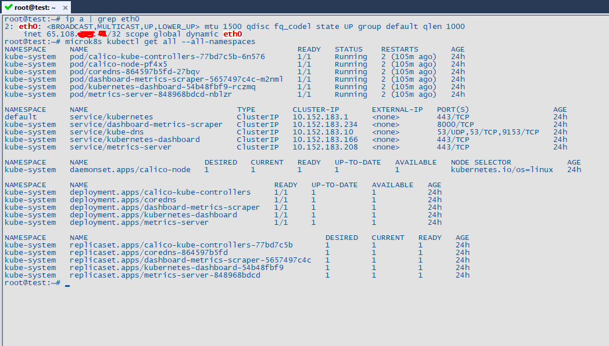
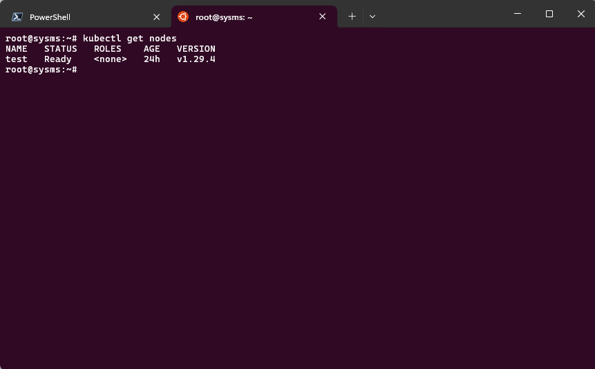
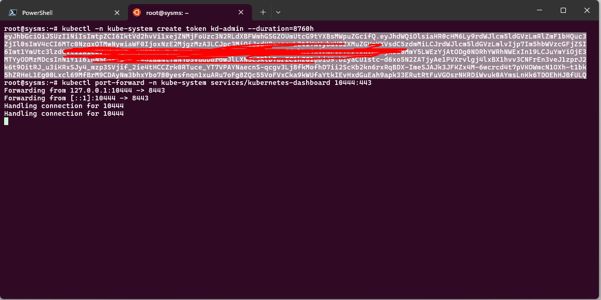
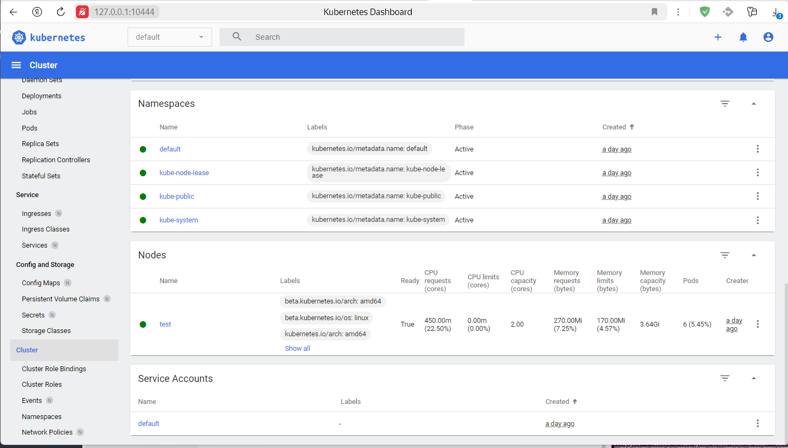

# Домашнее задание "Kubernetes. Причины появления. Команда kubectl"
### Задание 1. Установка MicroK8S
1. Установить MicroK8S на локальную машину или на удалённую виртуальную машину.

Установлен на удаленный сервер Ubuntu 22.04

    root@test:~# snap install microk8s --classic
    2024-05-20T13:32:40+05:00 INFO Waiting for automatic snapd restart...
    microk8s (1.29/stable) v1.29.4 from Canonical✓ installed

    root@test:~# microk8s start

2. Установить dashboard.
####
    microk8s enable dashboard

3. Сгенерировать сертификат для подключения к внешнему ip-адресу.

Добавил внешний ip для подключения к кластеру

    nano /var/snap/microk8s/current/certs/csr.conf.template

    [ req ]
    default_bits = 2048
    prompt = no
    default_md = sha256
    req_extensions = req_ext
    distinguished_name = dn

    [ dn ]
    C = GB
    ST = Canonical
    L = Canonical
    O = Canonical
    OU = Canonical
    CN = 127.0.0.1

    [ req_ext ]
    subjectAltName = @alt_names

    [ alt_names ]
    DNS.1 = kubernetes
    DNS.2 = kubernetes.default
    DNS.3 = kubernetes.default.svc
    DNS.4 = kubernetes.default.svc.cluster
    DNS.5 = kubernetes.default.svc.cluster.local
    IP.1 = 127.0.0.1
    IP.2 = 10.152.183.1
    IP.3 = 65.108.xxx.xxx
    #MOREIPS

    [ v3_ext ]
    authorityKeyIdentifier=keyid,issuer:always
    basicConstraints=CA:FALSE
    keyUsage=keyEncipherment,dataEncipherment,digitalSignature
    extendedKeyUsage=serverAuth,clientAuth
    subjectAltName=@alt_names
####
Обновил сертификат

    microk8s refresh-certs --cert front-proxy-client.crt

Скриншот с удаленного сервера

### Задание 2. Установка и настройка локального kubectl
1. Установить на локальную машину kubectl.

Установил в WSL Ubuntu 24.04

    root@sysms:~# curl -LO "https://dl.k8s.io/release/$(curl -L -s https://dl.k8s.io/release/stable.txt)/bin/linux/amd64/kubectl"
    root@sysms:~# curl -LO "https://dl.k8s.io/release/$(curl -L -s https://dl.k8s.io/release/stable.txt)/bin/linux/amd64/kubectl.sha256"
    root@sysms:~# echo "$(cat kubectl.sha256)  kubectl" | sha256sum --check
    kubectl: OK
    root@sysms:~# install -o root -g root -m 0755 kubectl /usr/local/bin/kubectl

    root@sysms:~# kubectl version --client
    Client Version: v1.30.1
    Kustomize Version: v5.0.4-0.20230601165947-6ce0bf390ce3

2. Настроить локально подключение к кластеру.

- На удаленном сервере вывел конфиг кластера ``microk8s config``
- Скопировал его на локальную машину в ~/.kube/config
- На локальной машине выполнил ``kubectl get nodes``

3. Подключиться к дашборду с помощью port-forward.
####
    root@sysms:~# kubectl port-forward -n kube-system services/kubernetes-dashboard 10444:443

Сгенерировал токен для доступа к дашборду

    root@sysms:~# kubectl create serviceaccount kd-admin -n kube-system
    root@sysms:~# kubectl create clusterrolebinding kd-admin --clusterrole=cluster-admin --serviceaccount=kube-system:kd-admin
    root@sysms:~# kubectl -n kube-system create token kd-admin --duration=8760h

Далее полученный токен использовал для входа

