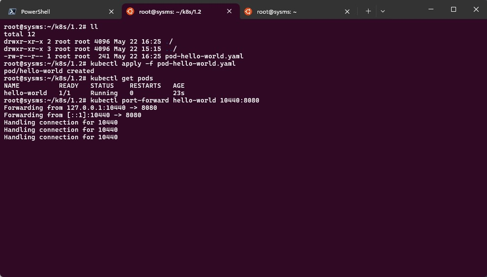
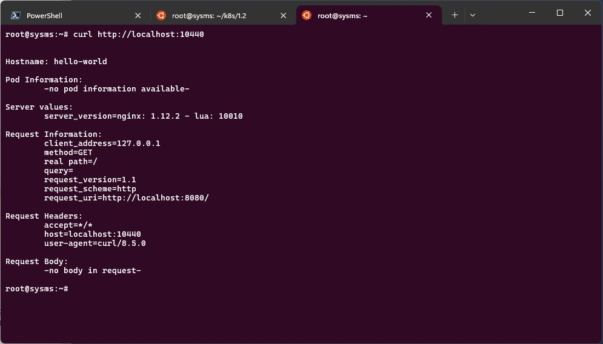
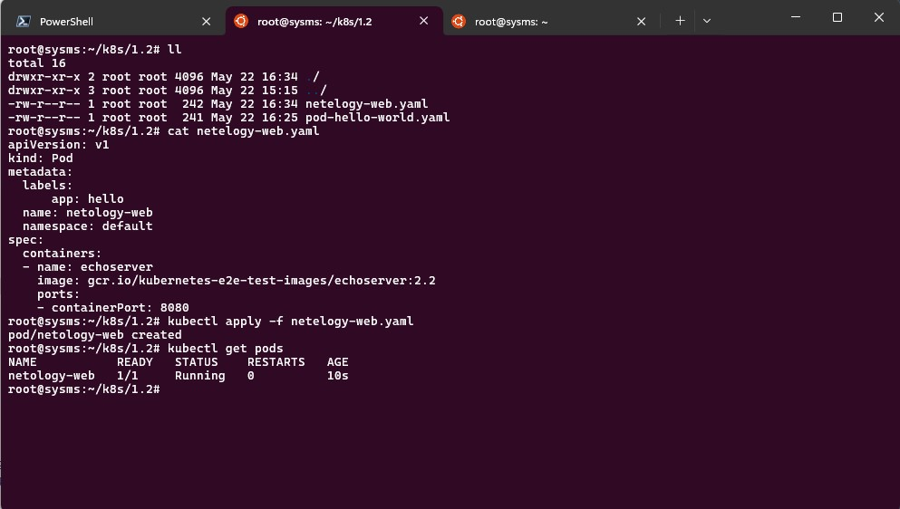
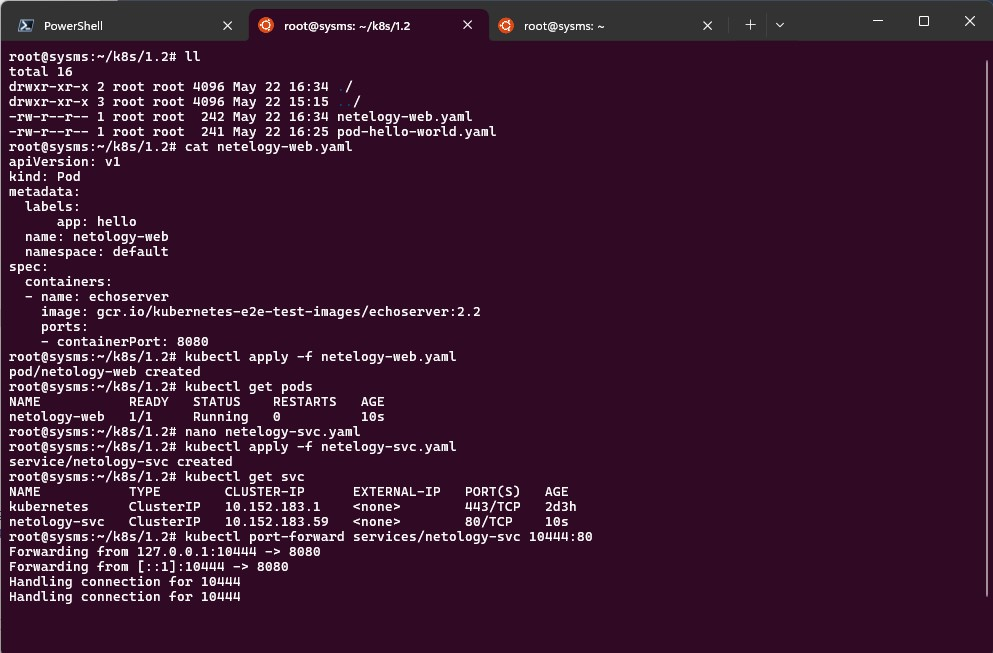
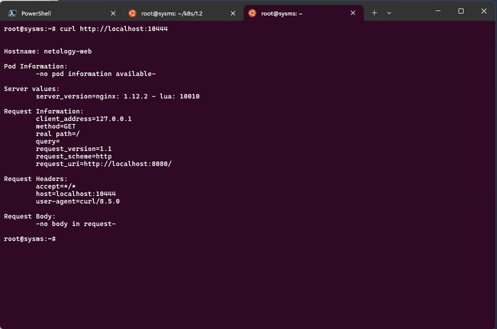

# Домашнее задание к занятию «Базовые объекты K8S»
### Задание 1. Создать Pod с именем hello-world
1. Создать манифест (yaml-конфигурацию) Pod.
2. Использовать image - gcr.io/kubernetes-e2e-test-images/echoserver:2.2.
#####
    root@sysms:~/k8s/1.2# cat pod-hello-world.yaml

    apiVersion: v1
    kind: Pod
    metadata:
      labels:
          app: hello
      name: hello-world
      namespace: default
    spec:
      containers:
      - name: echoserver
        image: gcr.io/kubernetes-e2e-test-images/echoserver:2.2
        ports:
        - containerPort: 80

    root@sysms:~/k8s/1.2# kubectl apply -f pod-hello-world.yaml
    pod/hello-world created

    root@sysms:~/k8s/1.2# kubectl get pods
    NAME          READY   STATUS              RESTARTS   AGE
    hello-world   0/1     ContainerCreating   0          3s

    root@sysms:~/k8s/1.2# kubectl get pods
    NAME          READY   STATUS    RESTARTS   AGE
    hello-world   1/1     Running   0          91s
3. Подключиться локально к Pod с помощью kubectl port-forward и вывести значение (curl или в браузере).

Во второй вкладке (сессии) выполняю curl

### Задание 2. Создать Service и подключить его к Pod
1. Создать Pod с именем netology-web.
2. Использовать image — gcr.io/kubernetes-e2e-test-images/echoserver:2.2.

3. Создать Service с именем netology-svc и подключить к netology-web.
#####
    root@sysms:~# cat k8s/1.2/netelogy-svc.yaml
    apiVersion: v1
    kind: Service
    metadata:
      name: netology-svc
    spec:
      selector:
        app: hello
      ports:
        - protocol: TCP
          port: 80
          targetPort: 8080

4. Подключиться локально к Service с помощью kubectl port-forward и вывести значение (curl или в браузере).

curl

