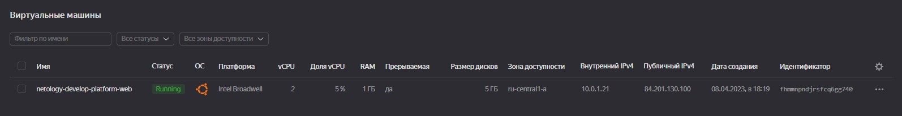
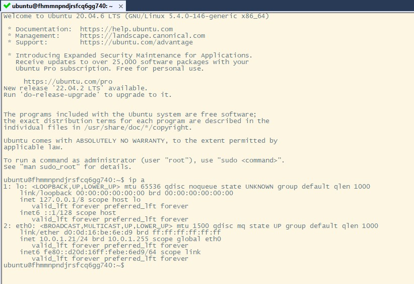

## Домашнее задание к занятию "Основы Terraform. Yandex Cloud"
### Цель задания
1. Создать свои ресурсы в облаке Yandex Cloud с помощью Terraform.
2. Освоить работу с переменными Terraform.
### Чек-лист готовности к домашнему заданию
1. Зарегистрирован аккаунт в Yandex Cloud. Использован промокод на грант.
2. Установлен инструмент Yandex Cli.
3. Исходный код для выполнения задания расположен в директории [02/src](https://github.com/netology-code/ter-homeworks/tree/main/02/src).
### Задание 0
1. Ознакомьтесь с документацией к [security-groups в Yandex Cloud](https://cloud.yandex.ru/docs/vpc/concepts/security-groups?from=int-console-help-center-or-nav).
2. Запросите preview доступ к данному функционалу в ЛК Yandex Cloud. Обычно его выдают в течении 24-х часов. https://console.cloud.yandex.ru/folders/<ваш cloud_id>/vpc/security-groups Этот функционал понадобится к следующей лекции.
### Задание 1
1. Изучите проект. В файле variables.tf объявлены переменные для yandex provider.
2. Переименуйте файл personal.auto.tfvars_example в personal.auto.tfvars. Заполните переменные (идентификаторы облака, токен доступа). Благодаря .gitignore этот файл не попадет в публичный репозиторий. Вы можете выбрать иной способ безопасно передать секретные данные в terraform.
- [x] Выполнено.
3. Сгенерируйте или используйте свой текущий ssh ключ. Запишите его открытую часть в переменную vms_ssh_root_key.
- [x] Выполнено.
4. Инициализируйте проект, выполните код. Исправьте возникшую ошибку. Ответьте в чем заключается ее суть?
- [x] Была одна ошибка о том, что на платформе standart-v1 допустимое количество ядер 2,4
5. Ответьте, как в процессе обучения могут пригодиться параметры preemptible = true и core_fraction=5 в параметрах ВМ? Ответ в документации Yandex cloud.
- [x] preemptible = true - прерывание ВМ в любой момент времени.
- [x] preemptible = true - выбирается исходя из потребности работы приложения.
##### Так как мы используем облако для обучения, нам не нужны большие ресурсы, и экономия средств.
##### В качестве решения приложите:
+ скриншот ЛК Yandex Cloud с созданной ВМ,

+ скриншот успешного подключения к консоли ВМ через ssh,
#####

### Задание 2
1. Изучите файлы проекта.
2. Замените все "хардкод" значения для ресурсов yandex_compute_image и yandex_compute_instance на отдельные переменные. К названиям переменных ВМ добавьте в начало префикс vm_web_ . Пример: vm_web_name.
3. Объявите нужные переменные в файле variables.tf, обязательно указывайте тип переменной. Заполните их default прежними значениями из main.tf.
4. Проверьте terraform plan (изменений быть не должно).
