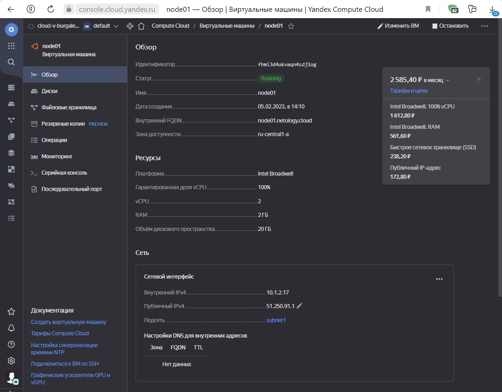
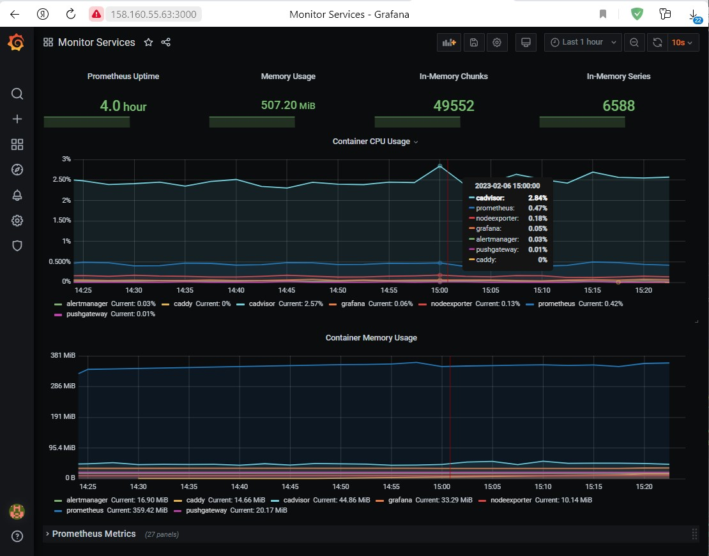
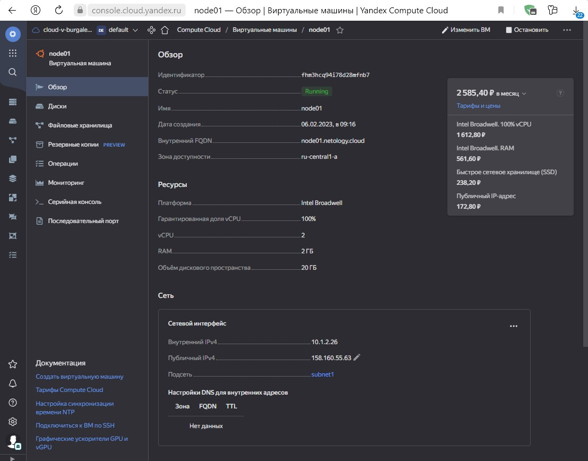

## омашнее задание к занятию "4. Оркестрация группой Docker контейнеров на примере Docker Compose"
### Задача 1
#### Создать собственный образ любой операционной системы (например, ubuntu-20.04) с помощью Packer (инструкция)
#### Для получения зачета вам необходимо предоставить скриншот страницы с созданным образом из личного кабинета YandexCloud.
    root@test:~/netology/packer# cat ubuntu20.04 
    {
        "builders": [
            {
          "type": "yandex",
          "token": "<token>",
          "folder_id": "<folder_id>",
          "zone": "ru-central1-a",
          "image_name": "ubuntu-20-04-base",
          "image_family": "ubuntu-20-04-base",
          "image_description": "Ubuntu 20-04 base image",
          "source_image_family": "ubuntu-2004-lts",
          "subnet_id": "<subnet_id>",
          "use_ipv4_nat": true,
          "disk_type": "network-ssd",
          "ssh_username": "root"
        }
     ]
    }

    root@test:~/netology/packer# packer validate ubuntu20.04 
    The configuration is valid.

    root@test:~/netology/packer# packer build ubuntu20.04 
    yandex: output will be in this color.

    ==> yandex: Creating temporary RSA SSH key for instance...
    ==> yandex: Using as source image: fd8snjpoq85qqv0mk9gi (name: "ubuntu-20-04-lts-v20230130", family: "ubuntu-2004-lts")
    ==> yandex: Use provided subnet id <subnet_id>
    ==> yandex: Creating disk...
    ==> yandex: Creating instance...
    ==> yandex: Waiting for instance with id fhmjeapc1cnd0r580b8v to become active...
        yandex: Detected instance IP: 158.160.xxx.xxx
    ==> yandex: Using SSH communicator to connect: 158.160.xxx.xxx
    ==> yandex: Waiting for SSH to become available...
    ==> yandex: Connected to SSH!
    ==> yandex: Stopping instance...
    ==> yandex: Deleting instance...
        yandex: Instance has been deleted!
    ==> yandex: Creating image: ubuntu-20-04-base
    ==> yandex: Waiting for image to complete...
    ==> yandex: Success image create...
    ==> yandex: Destroying boot disk...
        yandex: Disk has been deleted!
    Build 'yandex' finished after 1 minute 57 seconds.

    ==> Wait completed after 1 minute 57 seconds

    ==> Builds finished. The artifacts of successful builds are:
    --> yandex: A disk image was created: ubuntu-20-04-base (id: fd89n5m3mbgso68b2qec) with family name ubuntu-20-04-base

### Задача 2
#### Создать вашу первую виртуальную машину в YandexCloud с помощью terraform. Используйте terraform код в директории (src/terraform)
#### Для получения зачета, вам необходимо предоставить вывод команды terraform apply и страницы свойств созданной ВМ из личного кабинета YandexCloud.
    root@test:~/netology/terraform# terraform apply

    Terraform used the selected providers to generate the following execution plan. Resource actions are indicated with the following symbols:
    #  + create

    Terraform will perform the following actions:

    # yandex_compute_instance.node01 will be created
    #  + resource "yandex_compute_instance" "node01" {
      + allow_stopping_for_update = true
      + created_at                = (known after apply)
      + folder_id                 = (known after apply)
      + fqdn                      = (known after apply)
      + hostname                  = "node01.netology.cloud"
      + id                        = (known after apply)
      + metadata                  = {
          + "ssh-keys" = <<-EOT
                ubuntu:ssh-rsa AAAAB3NzaC1yc2EAAAADAQABAAABgQC0aS0uJOz7IdR554vkpr0pvOdhEN8KCzcJeNk4sr/hX/X3ybU6zYoby4osSse6nWvgNDVtPBKi2Hj6Z/Gwv+WyEsmMWU+lgoSqJ2snrEvBYVxacjY1FnlDMSDEifCrFXHpQLOKtGfDpuRATl2vEZuEmVGe0j1Yzv9XEa12D17WQAUW3akojlscowe+Td0f/J+bXeE34YYJdyO464/mdPgOdKurNR76FZ3JZSEz79Vdr4dZUlBNKsjwSc6yIW8k2z0FzQ/gvAyVjaiCh2Y56sX6njwFt8yXxs2HqcI75x014tmSuGfUMy2l0EyrUYT/ZhZ1fGcdaZ9lGqB0CzvxuGg9hL3OBSkpV2XDZC71LbnRt8M8oEABDELgcPcrHX/+n1rpB9RP8yzCrNomjIYC3FnaeLHLlmFJo1p6NE9fYtMUcE5RxQDONBTmJxaGqVBke4qegBhprMv25hkAZHJGoLARwQaezDBPpk4+TSNHhXumWE5QA6HUa335uWlTFraZpI0= root@test
            EOT
        }
      + name                      = "node01"
      + network_acceleration_type = "standard"
      + platform_id               = "standard-v1"
      + service_account_id        = (known after apply)
      + status                    = (known after apply)
      + zone                      = "ru-central1-a"

      + boot_disk {
          + auto_delete = true
          + device_name = (known after apply)
          + disk_id     = (known after apply)
          + mode        = (known after apply)

          + initialize_params {
              + block_size  = (known after apply)
              + description = (known after apply)
              + image_id    = "fd89n5m3mbgso68b2qec"
              + name        = "root-node01"
              + size        = 20
              + snapshot_id = (known after apply)
              + type        = "network-nvme"
            }
        }

      + metadata_options {
          + aws_v1_http_endpoint = (known after apply)
          + aws_v1_http_token    = (known after apply)
          + gce_http_endpoint    = (known after apply)
          + gce_http_token       = (known after apply)
        }

      + network_interface {
          + index              = (known after apply)
          + ip_address         = (known after apply)
          + ipv4               = true
          + ipv6               = (known after apply)
          + ipv6_address       = (known after apply)
          + mac_address        = (known after apply)
          + nat                = true
          + nat_ip_address     = (known after apply)
          + nat_ip_version     = (known after apply)
          + security_group_ids = (known after apply)
          + subnet_id          = (known after apply)
        }

      + placement_policy {
          + host_affinity_rules = (known after apply)
          + placement_group_id  = (known after apply)
        }

      + resources {
          + core_fraction = 100
          + cores         = 2
          + memory        = 2
        }

      + scheduling_policy {
          + preemptible = (known after apply)
        }
    }

    # yandex_vpc_network.default will be created
      # + resource "yandex_vpc_network" "default" {
      + created_at                = (known after apply)
      + default_security_group_id = (known after apply)
      + folder_id                 = (known after apply)
      + id                        = (known after apply)
      + labels                    = (known after apply)
      + name                      = "network"
      + subnet_ids                = (known after apply)
    }

    # yandex_vpc_subnet.default will be created
    #  + resource "yandex_vpc_subnet" "default" {
      + created_at     = (known after apply)
      + folder_id      = (known after apply)
      + id             = (known after apply)
      + labels         = (known after apply)
      + name           = "subnet1"
      + network_id     = (known after apply)
      + v4_cidr_blocks = [
          + "10.1.2.0/24",
        ]
      + v6_cidr_blocks = (known after apply)
      + zone           = "ru-central1-a"
    }

    Plan: 3 to add, 0 to change, 0 to destroy.

    Changes to Outputs:
    #  + external_ip_address_node01_yandex_cloud = (known after apply)
    #  + internal_ip_address_node01_yandex_cloud = (known after apply)

    Do you want to perform these actions?
    Terraform will perform the actions described above.
    Only 'yes' will be accepted to approve.

    Enter a value: yes

    yandex_vpc_network.default: Creating...
    yandex_vpc_network.default: Creation complete after 1s [id=enpe583t4vcg72p04s9o]
    yandex_vpc_subnet.default: Creating...
    yandex_vpc_subnet.default: Creation complete after 1s [id=e9b8h5mnu17516n442ep]
    yandex_compute_instance.node01: Creating...
    yandex_compute_instance.node01: Still creating... [10s elapsed]
    yandex_compute_instance.node01: Still creating... [20s elapsed]
    yandex_compute_instance.node01: Still creating... [30s elapsed]
    yandex_compute_instance.node01: Still creating... [40s elapsed]
    yandex_compute_instance.node01: Creation complete after 50s [id=fhmi3d4ukvaqn4sdj1og]

    Apply complete! Resources: 3 added, 0 changed, 0 destroyed.

    Outputs:

    external_ip_address_node01_yandex_cloud = "51.250.91.1"
    internal_ip_address_node01_yandex_cloud = "10.1.2.17"

### Задача 3
#### С помощью ansible и docker-compose разверните на виртуальной машине из предыдущего задания систему мониторинга на основе Prometheus/Grafana . Используйте ansible код в директории (src/ansible)
#### Для получения зачета вам необходимо предоставить вывод команды "docker ps" , все контейнеры, описанные в (docker-compose), должны быть в статусе "Up".
    root@node01:~# docker ps
    CONTAINER ID   IMAGE                              COMMAND                  CREATED             STATUS                 PORTS                                                                              NAMES
    d40e7cbe799f   stefanprodan/caddy                 "/sbin/tini -- caddy…"   2 minutes ago       Up 2 minutes           0.0.0.0:3000->3000/tcp, 0.0.0.0:9090-9091->9090-9091/tcp, 0.0.0.0:9093->9093/tcp   caddy
    b94bfd95426b   grafana/grafana:7.4.2              "/run.sh"                About an hour ago   Up About an hour       3000/tcp                                                                           grafana
    99d8683e0f7f   prom/node-exporter:v0.18.1         "/bin/node_exporter …"   4 hours ago         Up 4 hours             9100/tcp                                                                           nodeexporter
    58ff9c1f3710   gcr.io/cadvisor/cadvisor:v0.47.0   "/usr/bin/cadvisor -…"   4 hours ago         Up 4 hours (healthy)   8080/tcp                                                                           cadvisor
    95ea170ddfd7   prom/prometheus:v2.17.1            "/bin/prometheus --c…"   4 hours ago         Up 4 hours             9090/tcp                                                                           prometheus
    3a6f8d62df8c   prom/alertmanager:v0.20.0          "/bin/alertmanager -…"   4 hours ago         Up 4 hours             9093/tcp                                                                           alertmanager
    6deb73f808cf   prom/pushgateway:v1.2.0            "/bin/pushgateway"       4 hours ago         Up 4 hours             9091/tcp                                                                           pushgateway

### Задача 4
 1. Откройте веб-браузер, зайдите на страницу http://<внешний_ip_адрес_вашей_ВМ>:3000.
 2. Используйте для авторизации логин и пароль из (.env-file).
 3. Изучите доступный интерфейс, найдите в интерфейсе автоматически созданные docker-compose панели с графиками(dashboards).
 4. Подождите 5-10 минут, чтобы система мониторинга успела накопить данные.
##### Для получения зачета, вам необходимо предоставить:

##### Скриншот работающего веб-интерфейса Grafana с текущими метриками, как на примере ниже

