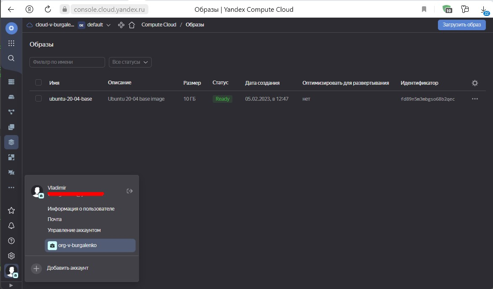

## омашнее задание к занятию "4. Оркестрация группой Docker контейнеров на примере Docker Compose"
### Задача 1
#### Создать собственный образ любой операционной системы (например, ubuntu-20.04) с помощью Packer (инструкция)
#### Для получения зачета вам необходимо предоставить скриншот страницы с созданным образом из личного кабинета YandexCloud.
    root@test:~/netology/packer# cat ubuntu20.04 
    {
        "builders": [
            {
          "type": "yandex",
          "token": "<token>",
          "folder_id": "<folder_id>",
          "zone": "ru-central1-a",
          "image_name": "ubuntu-20-04-base",
          "image_family": "ubuntu-20-04-base",
          "image_description": "Ubuntu 20-04 base image",
          "source_image_family": "ubuntu-2004-lts",
          "subnet_id": "<subnet_id>",
          "use_ipv4_nat": true,
          "disk_type": "network-ssd",
          "ssh_username": "root"
        }
     ]
    }

    root@test:~/netology/packer# packer validate ubuntu20.04 
    The configuration is valid.

    root@test:~/netology/packer# packer build ubuntu20.04 
    yandex: output will be in this color.

    ==> yandex: Creating temporary RSA SSH key for instance...
    ==> yandex: Using as source image: fd8snjpoq85qqv0mk9gi (name: "ubuntu-20-04-lts-v20230130", family: "ubuntu-2004-lts")
    ==> yandex: Use provided subnet id <subnet_id>
    ==> yandex: Creating disk...
    ==> yandex: Creating instance...
    ==> yandex: Waiting for instance with id fhmjeapc1cnd0r580b8v to become active...
        yandex: Detected instance IP: 158.160.xxx.xxx
    ==> yandex: Using SSH communicator to connect: 158.160.xxx.xxx
    ==> yandex: Waiting for SSH to become available...
    ==> yandex: Connected to SSH!
    ==> yandex: Stopping instance...
    ==> yandex: Deleting instance...
        yandex: Instance has been deleted!
    ==> yandex: Creating image: ubuntu-20-04-base
    ==> yandex: Waiting for image to complete...
    ==> yandex: Success image create...
    ==> yandex: Destroying boot disk...
        yandex: Disk has been deleted!
    Build 'yandex' finished after 1 minute 57 seconds.

    ==> Wait completed after 1 minute 57 seconds

    ==> Builds finished. The artifacts of successful builds are:
    --> yandex: A disk image was created: ubuntu-20-04-base (id: fd89n5m3mbgso68b2qec) with family name ubuntu-20-04-base

